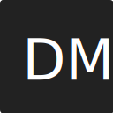
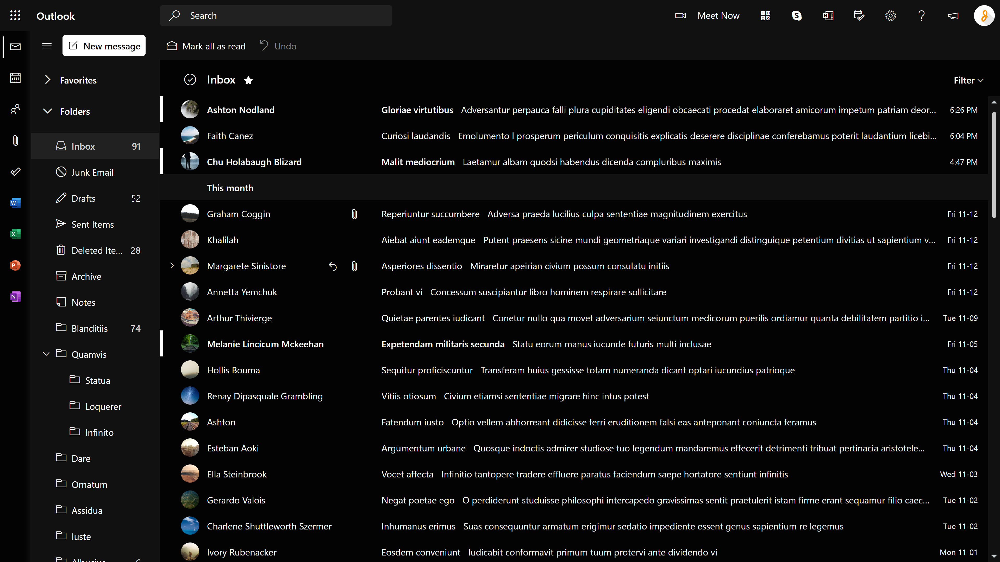
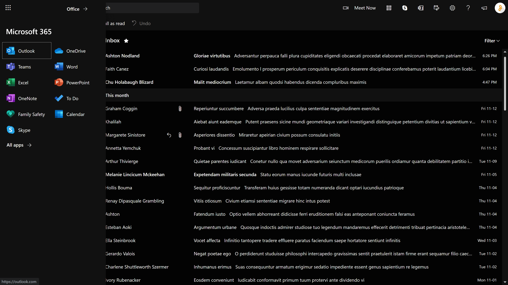
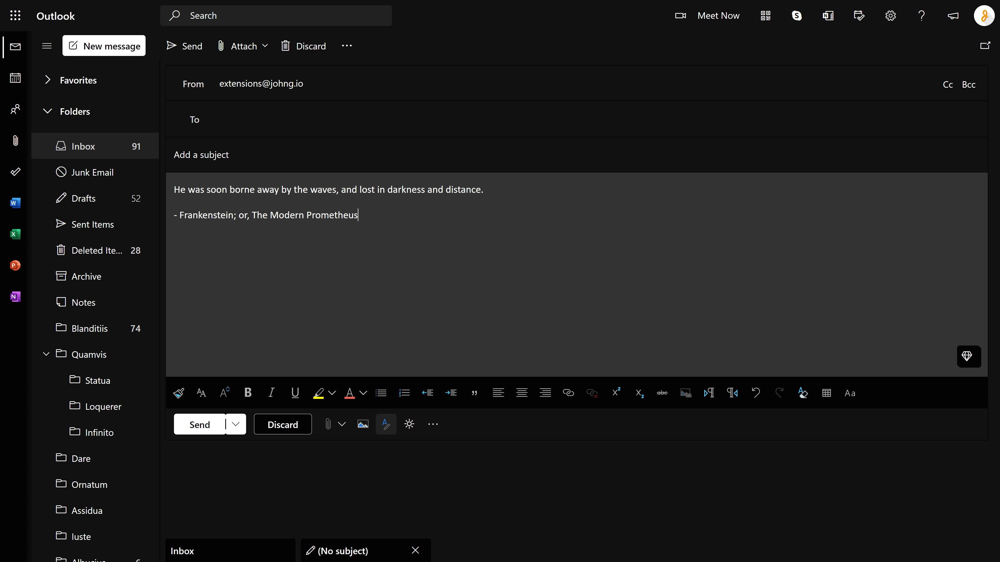
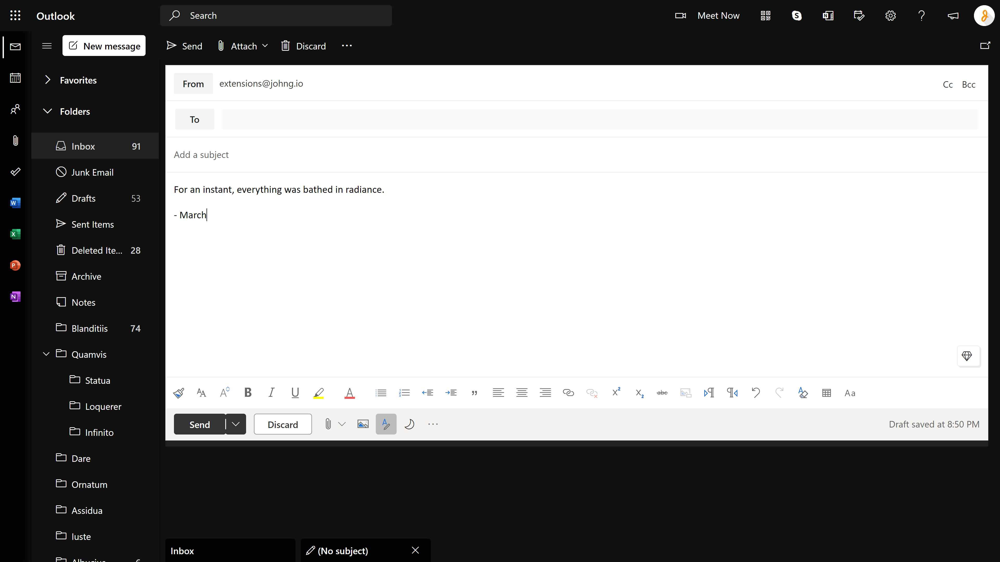

<!-- Project Header -->

  

  <h1 class="projectName">Dark Mode for Outlook</h1>

  

    
    
    
    
    
    
    
    
  

  
  

    A browser extension/add-on that applies a better dark theme to Microsoft Outlook and removes ads. Available for Chrome, Firefox, Edge, and Opera, with partial support for Firefox mobile!
  

  
   

## Installation
### Simple
The extension can be installed for your browser here:
| [![Chrome logo][chrome_logo]][chrome_link] | **[Chrome][chrome_link]** |
| - | - |
| [![Firefox logo][firefox_logo]][firefox_link] | **[Firefox][firefox_link]** |
| [![Edge logo][edge_logo]][edge_link] | **[Edge][edge_link]** |
| [![Opera logo][opera_logo]][opera_link] | **[Opera][opera_link]** |

**Notes:**
- It can also be installed on [Brave](https://support.brave.com/hc/en-us/articles/360017909112-How-can-I-add-extensions-to-Brave-), [Vivaldi](https://help.vivaldi.com/article/extensions/#install), and other Chromium-based browsers from the Chrome Web Store (or by sideloading).
- Installing add-ons for Firefox mobile is complicated at the moment, since Android's [new Geckoview-based browser](https://blog.mozilla.org/addons/2020/09/02/update-on-extension-support-in-the-new-firefox-for-android/) does not officially support all add-ons yet. If you still want to use this add-on on Firefox mobile, refer to [this page](https://support.mozilla.org/en-US/kb/find-and-install-add-ons-firefox-android#w_expanded-extension-support-in-firefox-for-android-nightly) for more information.

### Advanced
If you wish to build yourself, you can download the repository, run `npm install` to install dependencies, and build the project with `npm start`. Make sure you have npm and Node.js v10.0.0 or greater installed ([how?](https://docs.npmjs.com/downloading-and-installing-node-js-and-npm)). If you have any issues running the build script, you can perform all the steps in that script manually.

Next, the build directory or zip file can be loaded into your browser of choice: [Chrome](https://developer.chrome.com/extensions/getstarted#manifest) / [Firefox](https://extensionworkshop.com/documentation/develop/temporary-installation-in-firefox/) / [Edge](https://docs.microsoft.com/en-us/microsoft-edge/extensions-chromium/getting-started/part1-simple-extension#run-your-extension-locally-in-your-browser-while-developing-it-side-loading) / [Opera](https://dev.opera.com/extensions/testing/)

## Usage
Just install the extension and you should be good to go! Styles are automatically applied to any page on the following domains:
- http(s)://outlook.live.com/
- http(s)://outlook.office.com/
- http(s)://outlook.office365.com/
- http(s)://support.office.live.com/

Enable Outlook's built-in dark mode if you are able to do so, as this will ensure styles are applied correctly.

### Options
#### Compose Pane Styling
Whether to forcefully enable dark mode styling for the compose pane. Only enable this if you want the compose pane to be dark when your version of Outlook does not have a built-in dark mode. Outlook does not like us messing with these styles so this will likely be buggy. Consider leaving this unchecked and writing emails with the default white background instead.

If you are able to turn on Outlook's built-in dark mode, there is no point in enabling this option. Use the 'View with a dark background' button under the compose pane to toggle the background color.

#### Custom Domains
If your Outlook exchange server is running on a custom domain (ex. https://mail.yourcompany.com/owa), you can add it here so that the dark mode is applied for any page on this domain. This is still an experimental feature so styles may not be applied correctly. If you encounter any issues, please create a bug report.

Multiple domains can be added and styles will be added to any page starting with the given URL, so this doesn't need to be super specific. For example, if you add the domain `mail.yourcompany.com/owa`, styles will be applied to `https://mail.yourcompany.com/owa/inbox` or `http://mail.yourcompany.com/owa/mail?id=someId`, but not `https://mail.yourcompany.com/` or `http://otherstuff.yourcompany.com/owa/`.

This feature is optional. The necessary permissions are requested when you add a custom domain.

### Privacy
This extension does not collect or transmit any personal information. Please see below for an explanation of the permissions required by this extension.

#### Required Permissions
Access to any site on the following domains is required so we can apply custom styles:
- **"http(s)://outlook.live.com/"**
- **"http(s)://outlook.office.com/"**
- **"http(s)://outlook.office365.com/"**
- **"http(s)://support.office.live.com/"**

Access to storage is required so we can save extension settings.

#### Optional permissions
These permissions are requested only when they are needed:
- **"tabs":** Access to open tabs is required if you are using the [Custom Domains](#Custom%20Domains) feature. This is so we can check if any open tabs match the custom domains you specified
- **"http(s)://*/":** Access to 'any site' is required if you are using the [Custom Domains](#Custom%20Domains) feature. This is so we can apply styles to any domain you specify. Note that the extension does not have access to all sites. It will only request permissions for the specific custom domains you add

### Reporting Issues
Translations needed! If you know another language and want to help out, please see [CONTRIBUTING.md](CONTRIBUTING.md) for more details.

If you encounter any problems while using the extension, please create an issue [here][issues_link] or create a pull request yourself to fix the issue (see [Contributing](#Contributing)).

I try to fix the extension as soon as possible when Outlook makes breaking changes, but keep in mind it may take some time for me to fit the work into my schedule and make all the necessary changes. Thanks for your patience 🙂.

## Screenshots
Desktop site | &#8291;
:-:|:-:
 | 
 | 

## Contributing
Contributions, issues, and forks are welcome. Please see [CONTRIBUTING.md](CONTRIBUTING.md) for more details.

## License
This project is licensed under the [MIT License](LICENSE). This project includes various resources which carry their own copyright notices and license terms. See [LICENSE-THIRD-PARTY.md](LICENSE-THIRD-PARTY.md) for more details.

Outlook is a trademark of Microsoft and this project is not affiliated with or endorsed by Microsoft in any way.

[issues_link]: ../../issues

[chrome_link]: https://chrome.google.com/webstore/detail/dark-mode-for-outlook/kjfbefcenipnnpbcbbklcidpjiamlcpl
[firefox_link]: https://addons.mozilla.org/en-US/firefox/addon/dark-mode-for-outlook/
[edge_link]: https://microsoftedge.microsoft.com/addons/detail/ncmfoiokkfipenppipihehpoikhacpep
[opera_link]: https://addons.opera.com/en/extensions/details/dark-mode-for-outlook/

[chrome_logo]: https://cdnjs.cloudflare.com/ajax/libs/browser-logos/70.4.0/chrome/chrome_32x32.png
[firefox_logo]: https://cdnjs.cloudflare.com/ajax/libs/browser-logos/70.4.0/firefox/firefox_32x32.png
[edge_logo]: https://cdnjs.cloudflare.com/ajax/libs/browser-logos/70.4.0/edge/edge_32x32.png
[opera_logo]: https://cdnjs.cloudflare.com/ajax/libs/browser-logos/70.4.0/opera/opera_32x32.png
