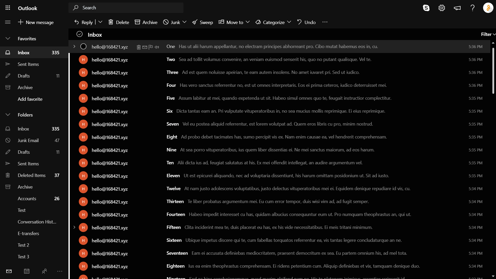
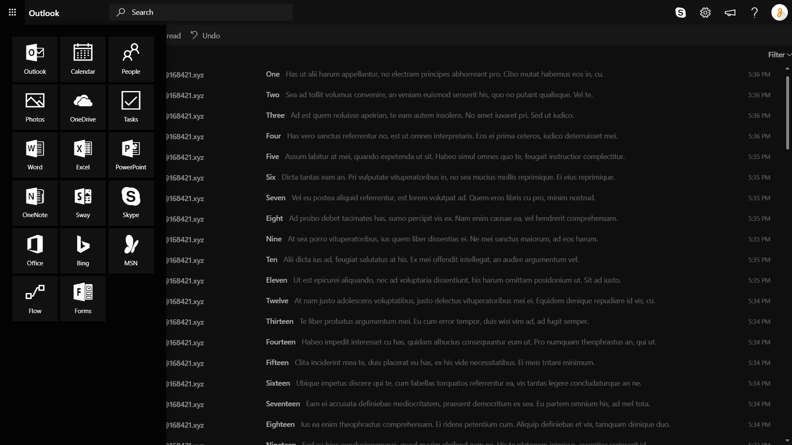
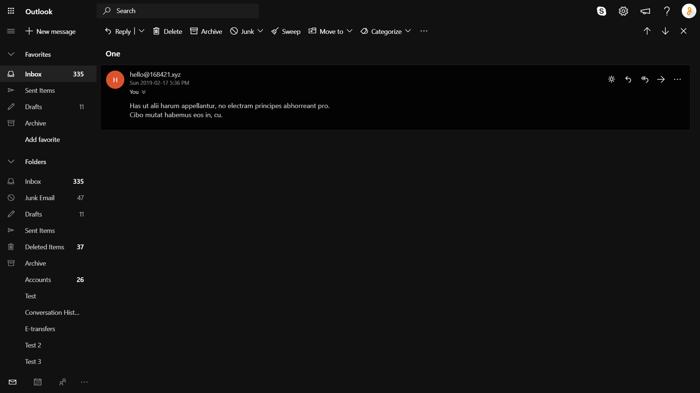
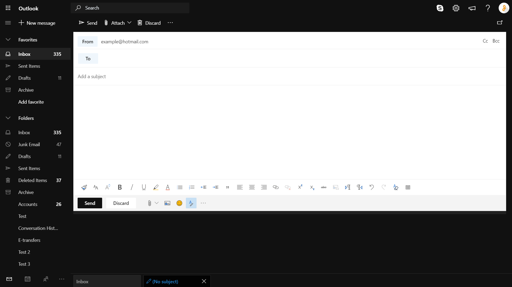
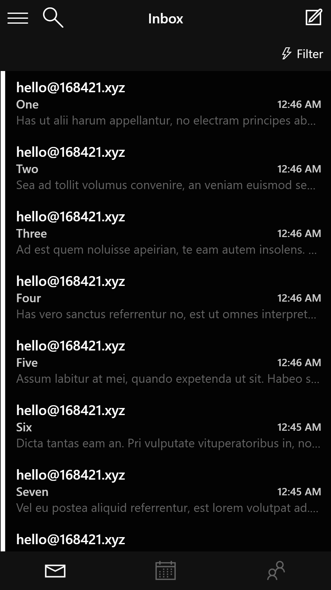
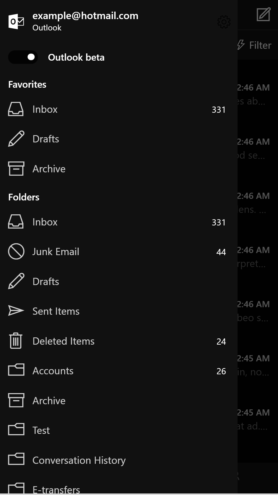
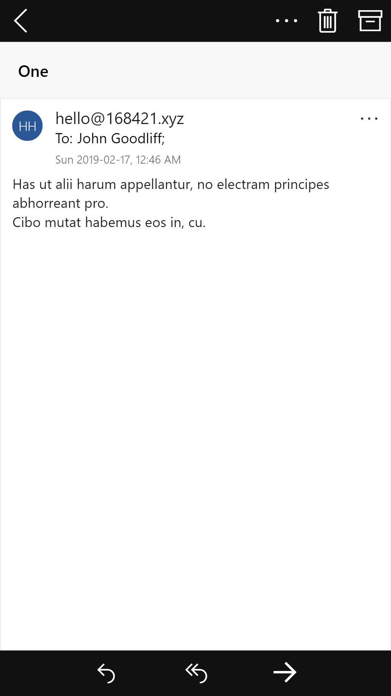
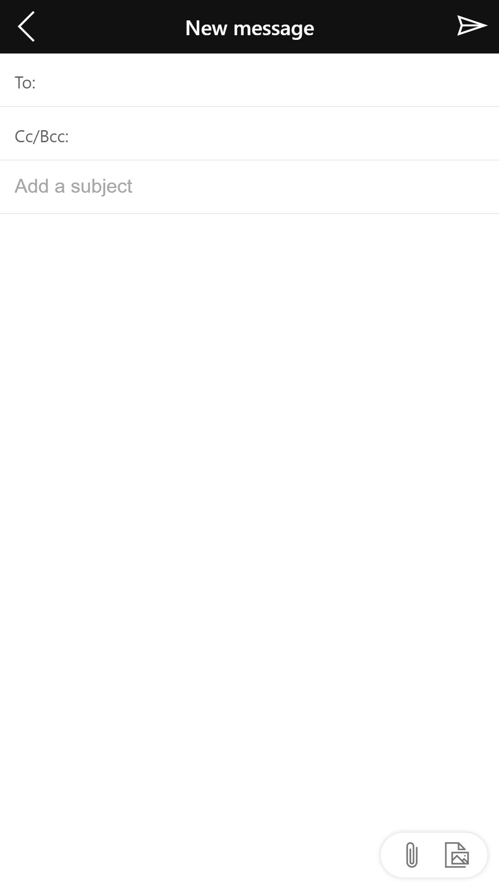

# Dark Mode for Outlook™ [Extension]

A Chrome extension/Firefox add-on that applies a better (unofficial) dark mode to Microsoft Outlook and removes the ad sidebar. Compatible with Firefox mobile!

## Installation
The extension can be installed from the Chrome Web Store [here](https://chrome.google.com/webstore/detail/dark-mode-for-outlook/kjfbefcenipnnpbcbbklcidpjiamlcpl) or from the Firefox Add-on page [here](https://addons.mozilla.org/en-US/firefox/addon/dark-mode-for-outlook/).

If you wish to build yourself, `build.sh` is used to copy all files to the `build/` directory, compile css, and zip the extension. You can do this any other way you wish. [SASS](https://sass-lang.com/) is used for CSS compilation. After running `build.sh`, the build directory can be loaded into Chrome. The `.zip` file can also be loaded into Firefox after renaming the file extension to `.xpi`.

## Usage
Just install the extension and go. Please **switch to Outlook Beta** on both desktop and mobile sites because I have not made a theme for classic Outlook yet. The extension does not have any other settings at the moment.

## Screenshots
Desktop site | &#8291;
:-:|:-:
 | 
 | 

Mobile site | &#8291; | &#8291; | &#8291;
:-:|:-:|:-:|:-:
 |  |  | 

## Contributing
Contributions, issues, and forks are welcome but this is a hobby project so don't expect too much from it. [SemVer](http://semver.org/) is used for versioning.

## License
This project is licensed under the MIT License. See [LICENSE.md](LICENSE.md) for details. Outlook is a trademark of Microsoft and this project is not affiliated with or endorsed by Microsoft in any way.
