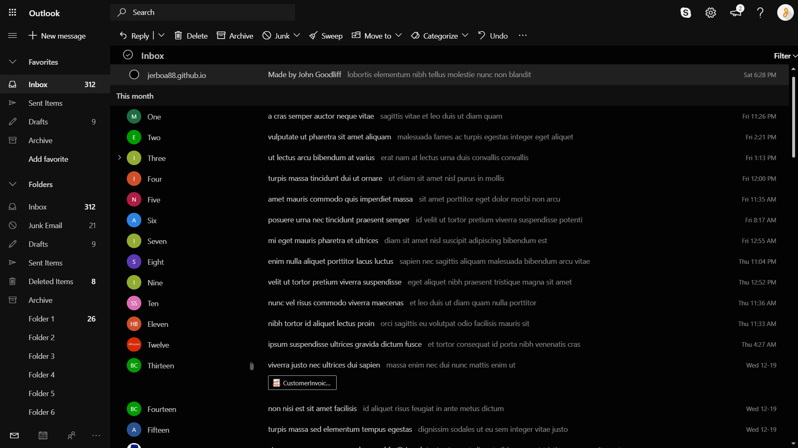
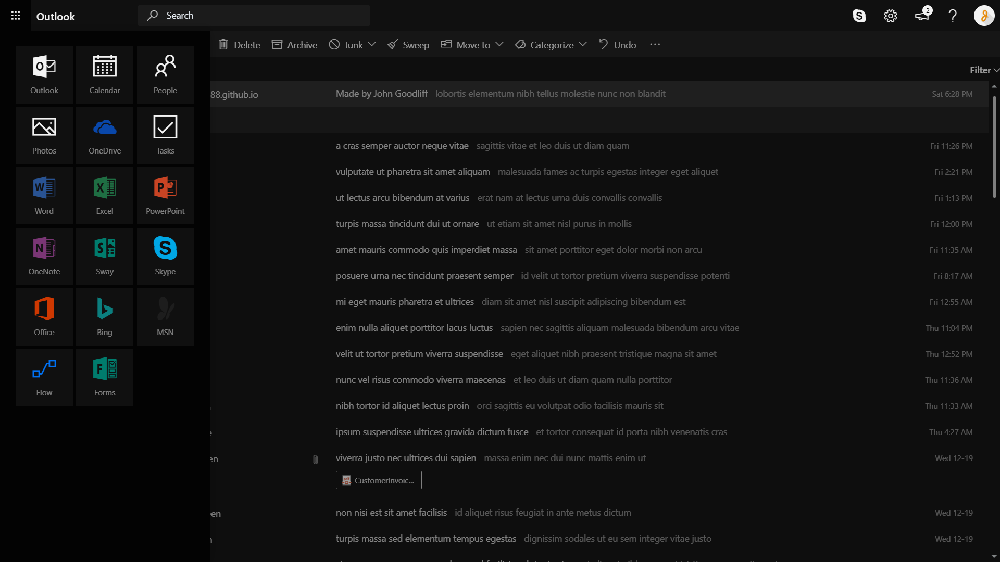
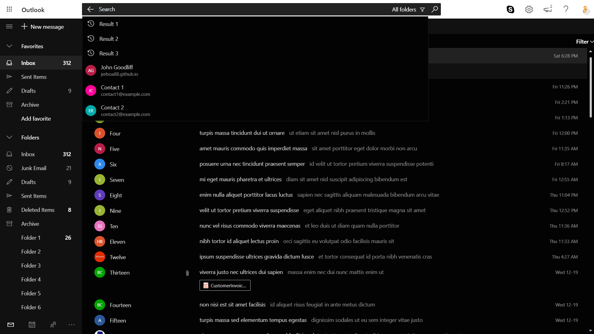
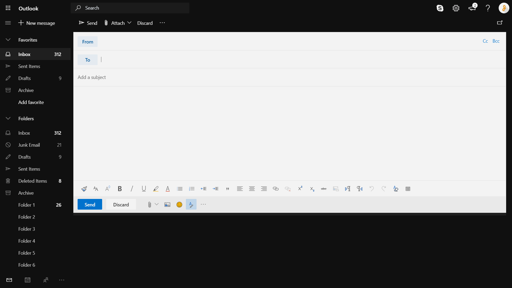

# Dark Mode for Outlook [Chrome Extension]

A chrome extension that applies a better dark mode to Outlook and removes ads. Not affiliated with Microsoft.

## Installation
Download or clone the repository and load the file into Chrome as an unpacked extension. Hopefully I will add this to the Chrome Store in the future.

## Screenshots
1 | 2
:-:|:-:
 | 

2 | 4
:-:|:-:
 | 

## Contributing
Contributions and forks are welcome but this is a hobby project so don't expect too much from it. [SemVer](http://semver.org/) is used.

## License
This project is licensed under the MIT License. See [LICENSE.md](LICENSE.md) for details.
